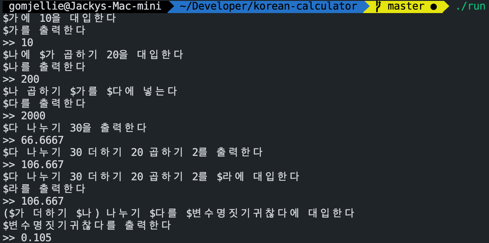

# `korean-calculator`
LRParser 로 만든 한글 계산기 (feat. lex, yacc)

컴파일러 과목 사이드프로젝트



# 문법

## 변수

- 변수는 (가|나|다|라|마|바|사|아) 한글자다.

## 연산

- 연산의 우선순위는 괄호 `()` 로 둘러싼 식이 높다.
- 연산의 우선순위는 곱하기 나누기가 더하기 빼기보다 높다.
- unary expression 으로 마이너스값을 표기 가능하다.

### 더하기

한글 `더하기`라고 표기하거나 기호 `+`로 표기한다.

- 10 더하기 2
- 10 + 2

### 빼기

한글 `빼기`라고 표기하거나 기호 `-`로 표기한다.

- 가 더하기 나
- 가 + 나

### 곱하기

한글 `곱하기`라고 표기하거나 기호 `*`로 표기한다.

- 20 곱하기 나
- 20 * 나

### 나누기

한글 `나누기`라고 표기하거나 기호 `/`로 표기한다.

나누는수가 0이되면 에러가 발생한다.

- 20 나누기 나
- 20 / 나

## 대입

### 변수`에` 표현식`[을|를]` 대입한다

```sh
가에 10 곱하기 2를 대입한다.
```

### 표현식`[을|를]` 변수`에` 대입한다

```sh
10나누기 2를 가에 대입한다.
```

## 변수 값 확인하기

### 변수명 입력

```sh
가
>>     는 20입니다.
```

# 빌드

```sh
make
```

macOS에서만 작동 확인함.
